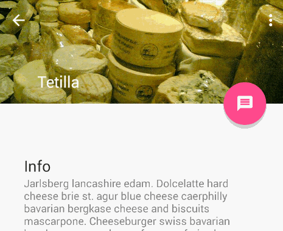
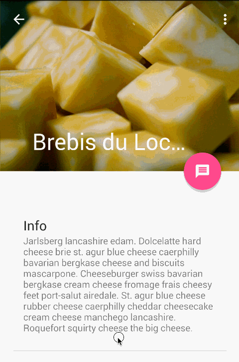

## Note

#### Basic Steps of using Toolbar inside CoordinatorLayout


We are going to build this type of animation. To do this we have to follow the following steps:

1. Make sure you have this Gradle dependency added to your app/build.gradle file:
    ```java
    dependencies {
      compile 'com.android.support:design:25.2.0'
    }
    ```
2. Edit ```activity_main.xml``` with the following code

    ```xml
    <?xml version="1.0" encoding="utf-8"?>
    <android.support.design.widget.CoordinatorLayout
        xmlns:android="http://schemas.android.com/apk/res/android"
        xmlns:app="http://schemas.android.com/apk/res-auto"
        xmlns:tools="http://schemas.android.com/tools"
        android:layout_width="match_parent"
        android:layout_height="match_parent"
        android:fitsSystemWindows="true">

        <android.support.design.widget.AppBarLayout
            android:id="@+id/appbar"
            android:layout_width="match_parent"
            android:layout_height="wrap_content"
            android:theme="@style/ThemeOverlay.AppCompat.Dark.ActionBar"
            android:fitsSystemWindows="true">

            <android.support.v7.widget.Toolbar
                android:id="@+id/toolbar"
                android:layout_width="match_parent"
                android:layout_height="?attr/actionBarSize"
                android:fitsSystemWindows="true"
                app:layout_scrollFlags="scroll|enterAlwaysCollapsed"/>

        </android.support.design.widget.AppBarLayout>

        <android.support.v4.widget.NestedScrollView
            android:layout_width="match_parent"
            android:layout_height="match_parent"
            android:id="@+id/main_container"
            app:layout_behavior="@string/appbar_scrolling_view_behavior">

            <TextView
                android:layout_width="match_parent"
                android:layout_height="wrap_content"
                android:padding="30dp"
                android:text="@string/large_text"/>

        </android.support.v4.widget.NestedScrollView>

        <android.support.design.widget.FloatingActionButton
            android:layout_width="wrap_content"
            android:layout_height="wrap_content"
            android:layout_margin="16dp"
            android:src="@mipmap/ic_launcher"
            app:layout_anchor="@id/main_container"
            app:layout_anchorGravity="bottom|right|end" />

    </android.support.design.widget.CoordinatorLayout>
    ```

    1. ```android:fitsSystemWindows="true"``` attribute must have to be added in the following layouts
        1. CoordinatorLayout
        1. AppBarLayout
        1. Toolbar
    1. __AppBarLayout__ currently expects to be the direct child nested within a CoordinatorLayout according to the official [Google docs](https://developer.android.com/reference/android/support/design/widget/AppBarLayout.html).
    1. In the __AppBarLayout__ make the ```android:layout_height``` to use ```wrap_content``` and use the ```android:theme``` attribute and add a theme to it.
    1. Give the __Toolbar__ a height using ```android:layout_height="?attr/actionBarSize"``` or ```android:layout_height="80dp"```.
    1. Add ```app:layout_scrollFlags="scroll|enterAlwaysCollapsed"``` this attribute to the __Toolbar__ to have the scroll animation.  Find more details about the scroll_flag [here](https://github.com/codepath/android_guides/wiki/Handling-Scrolls-with-CoordinatorLayout#responding-to-scroll-events)
    1. In the __NestedScrollView__ use ```app:layout_behavior="@string/appbar_scrolling_view_behavior"``` attribute to tell the CoordinatorLayout that you want to have AppBarLayout Scroll animation
    1. Inside TextView by using ```android:text="@string/large_text"```, I have added a long string from the resource folder.
    1. You can also use FloatingActionButton to have a FAB button. Inside FloatingActionButton you must have to add ```app:layout_anchor``` and ```app:layout_anchorGravity``` attributes

1. In the ```onCreate``` method of Activity class add a Toolbar reference variable and set title to the Toolbar.
    ```java
    @Override
    protected void onCreate(Bundle savedInstanceState) {
        ......
        Toolbar toolbar = (Toolbar) findViewById(R.id.toolbar);
        toolbar.setTitle("Hello");
    }
    ```
1. Change the parent of base base style from DarkActionbar to NoActionBar. Add ```android:actionBarSize``` item to change the Toolbar height
    ```xml
    <style name="AppTheme" parent="Theme.AppCompat.Light.NoActionBar">

        ....

        <item name="android:actionBarSize">80dp</item>
    </style>
    ```


#### Basic Steps of using CollapsingToolbarLayout inside CoordinatorLayout



We are going to build this type of animation. To do this we have to follow the following steps:

1. At first follow every steps of __Basic Steps of using Toolbar inside CoordinatorLayout__
2. In the xml file edit the __AppBarLayout__ by this
    ```xml
    <android.support.design.widget.AppBarLayout
        android:id="@+id/appbar"
        android:layout_width="match_parent"
        android:layout_height="250dp"
        android:theme="@style/ThemeOverlay.AppCompat.Dark.ActionBar"
        android:fitsSystemWindows="true">

        <android.support.design.widget.CollapsingToolbarLayout
            android:id="@+id/collapsingToolbar"
            android:layout_width="match_parent"
            android:layout_height="match_parent"
            android:fitsSystemWindows="true"
            app:contentScrim="?attr/colorPrimary"
            app:layout_scrollFlags="scroll|exitUntilCollapsed">

            <ImageView
                android:layout_width="match_parent"
                android:layout_height="match_parent"
                android:fitsSystemWindows="true"
                android:scaleType="centerCrop"
                android:src="@drawable/landscape"
                app:layout_collapseMode="parallax"/>

            <android.support.v7.widget.Toolbar
                android:id="@+id/toolbar"
                android:layout_width="match_parent"
                android:layout_height="?attr/actionBarSize"
                android:fitsSystemWindows="true"
                app:layout_collapseMode="pin"/>

        </android.support.design.widget.CollapsingToolbarLayout>

    </android.support.design.widget.AppBarLayout>
    ```
    1. The value of ```android:layout_height``` of the ```AppBarLayout``` has been changed from ```wrap_content``` to ```250dp```
    1. ```android:fitsSystemWindows="true"``` attribute has been added to the every layout and view above.
    1. ```app:contentScrim="?attr/colorPrimary"``` attribute has been added to the CollapsingToolbarLayout to have the background of colorPrimary.
    1. ```app:layout_scrollFlags``` attribute has been removed from __Toolbar__ and added to the __CollapsingToolbarLayout__. you can add ```app:layout_scrollFlags``` attribute to only direct children of __AppBarLayout__
    1. ```app:layout_collapseMode``` attribute has been added to the every children of __CollapsingToolbarLayout__ to have nice animation effect.


1. In the ```onCreate``` method of Activity class add a Toolbar and CollapsingToolbarLayout reference variable and do the followings:
    ```java
    @Override
    protected void onCreate(Bundle savedInstanceState) {
        ......
        Toolbar toolbar = (Toolbar) findViewById(R.id.toolbar);
        setSupportActionBar(toolbar);

        CollapsingToolbarLayout coll = (CollapsingToolbarLayout) findViewById(R.id.collapsingToolbar);
        coll.setTitle("Hello");
    }
    ```
    * Don't setTitle using Toolbar. Set title using CollapsingToolbarLayout
    * set SupportActionBar using toolbar

1. Edit the base theme by followings:
    ```xml
    <style name="AppTheme" parent="Theme.AppCompat.Light.NoActionBar">
        <!-- Customize your theme here. -->
        <item name="colorPrimary">@color/colorPrimary</item>
        <item name="colorPrimaryDark">@color/colorPrimaryDark</item>
        <item name="colorAccent">@color/colorAccent</item>
        <item name="android:windowDrawsSystemBarBackgrounds">true</item>
        <item name="android:statusBarColor">@android:color/transparent</item>
    </style>
    ```
    * I have removed ```android:actionBarSize``` item from the base theme. because in this case the item causing more height than usual. I dont know why :worried:
    * added two new item to have nice look.


1. Value of two attributes of FloatingActionButton has been changed to placed the FAB upperside
    ```java
    <android.support.design.widget.FloatingActionButton
        ......
        app:layout_anchor="@id/appbar"
        app:layout_anchorGravity="bottom|right"/>
    ```
1. Now you have you desired animation. enjoy...... :smile:




To have this type of animation do the followings:

1. Follow every steps described above.

1. Add ```android:minHeight="80dp"``` attribute and edit ```app:layout_scrollFlags``` attribute of __CollapsingToolbarLayout__
    ```java
    <android.support.design.widget.CollapsingToolbarLayout
            ......
            android:minHeight="80dp"
            app:layout_scrollFlags="scroll|enterAlways|enterAlwaysCollapsed">

            ......

    ```
