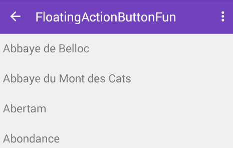

## Note

#### Basic Steps of using Toolbar inside CoordinatorLayout



1. Make sure you have this Gradle dependency added to your app/build.gradle file:
    ```java
    dependencies {
      compile 'com.android.support:design:25.2.0'
    }
    ```
